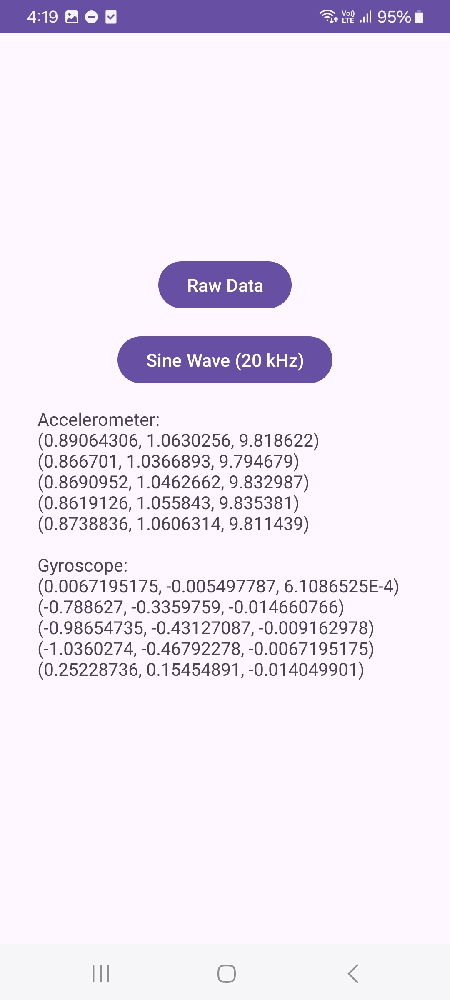
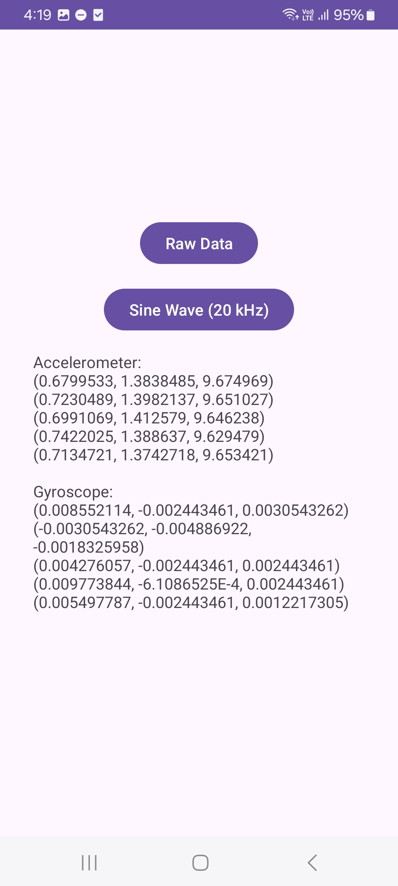
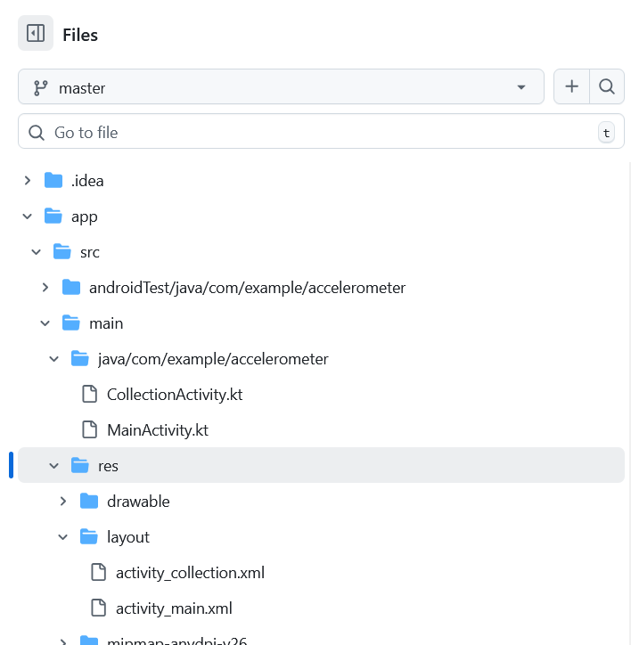

# Sensor Demo

This is an Android app that demonstrates:
- Conditional navigation (proceed only if the phone is flat on a surface).
- Collection of accelerometer and gyroscope readings using the Sensors API
- Playing a pure 20 kHz sine wave while collecting sensor data.

---

## Features

- **Flat-surface check**: The "Proceed" button works only when the phone is placed flat.  
- **Raw Data mode**: Collects 10 raw accelerometer and gyroscope readings.  
- **Sine Wave mode**: Plays a 20 kHz sine wave while collecting 10 sensor readings.
---

## Screenshots

Main screen:



Collection screen:



---

## File Locations

You can directly look over the code and XML layouts in 


Code: app / main / java/com/example/accelerometer/
Layout: app / main / res / layout/

## Installation

1. Clone this repository:
   ```bash
   git clone https://github.com/<your-username>/SensorApp.git
